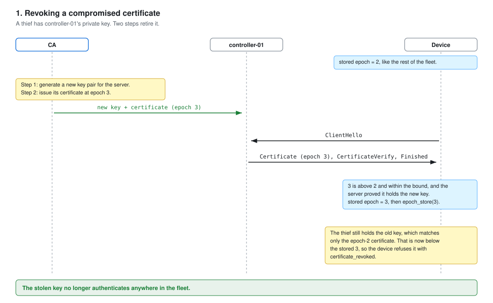
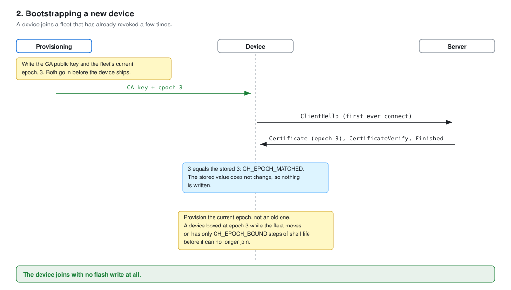
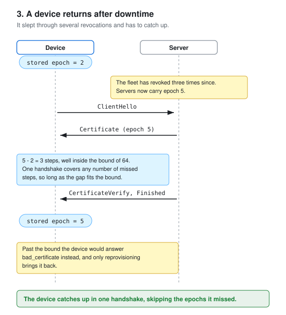
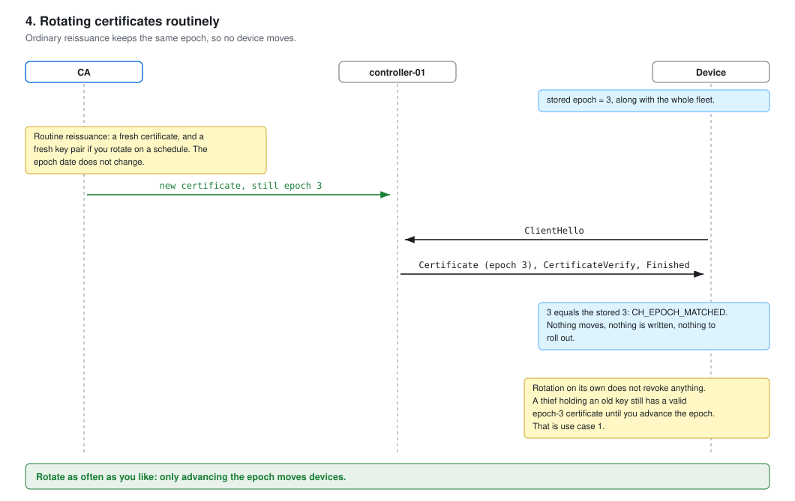
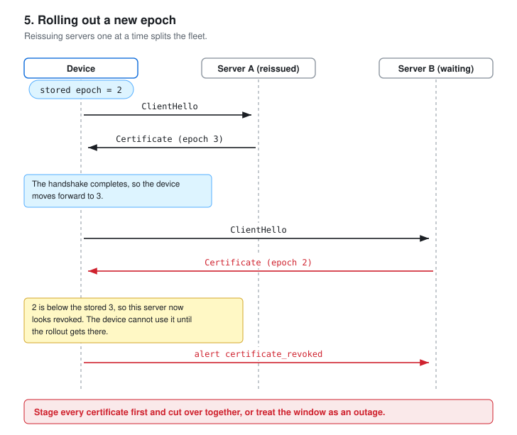
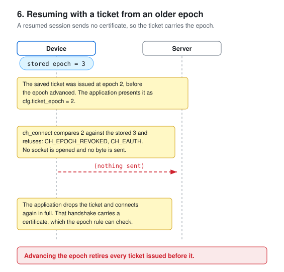
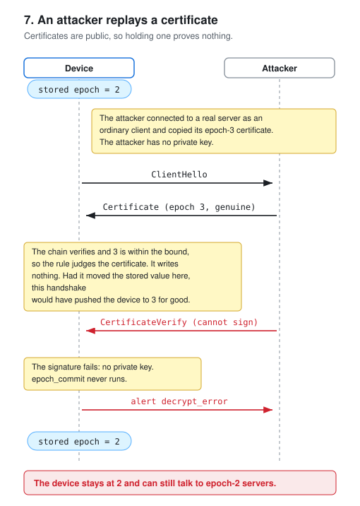

# Operating a CA for chapulin devices

Status: the parser, its proofs, and the `TRUST=ca` build that uses
them are in the tree. This document is the operational contract that
build depends on. Read it before issuing anything.

## Three jobs, three readers

This document covers three different machines. Find yours.

| You run | You do | Sections |
| --- | --- | --- |
| The CA | Issue and reissue certificates | What the CA must sign, Issuance recipes, Verify an issued certificate, From certificate to pinned key, Key custody, CA software examples |
| A server | Serve the right chain to devices | Server configuration |
| Devices | Provision keys, write firmware | Provisioning a device, What the device reports, The jump bound, Turning the epoch on |

The revocation epoch spans all three, so its section says which
machine each step belongs to.

## The trust model

A device pins one public key, the CA key, in the two provisioning
slots that pinned-key mode already uses. The server presents its own
certificate, or that plus the one intermediate that signed it. PKI
calls the server's own certificate the leaf, and the recipes below
use that word in file names.

The device checks signatures up to the pinned key, and checks the
certificate shape against a fixed profile. It checks nothing else: no
names, no expiry, no revocation lists. The one exception is optional:
with the monotonic epoch enabled, the device also reads the server
certificate's notBefore as a counter. The rules below make that small
check enough.

## What the CA must sign

One signature algorithm per device build, everywhere in the chain:

- RSA builds: RSASSA-PSS, SHA-256, MGF1-SHA-256, salt length 32.
  OpenSSL emits the exact accepted encoding with
  `-sigopt rsa_padding_mode:pss -sigopt rsa_pss_saltlen:32 -sha256`.
  PKCS#1 v1.5 signatures are rejected, always.
- ECDSA builds: ecdsa-with-SHA256 over P-256. OpenSSL's default for
  a P-256 key.

Leaf certificates carry exactly this extension profile:

    keyUsage = critical, digitalSignature
    extendedKeyUsage = serverAuth
    basicConstraints = CA:FALSE

extendedKeyUsage must be exactly serverAuth: a server certificate
without it, or
with any other purpose, never authenticates a server. This is the
device-side fence against mixed issuance — see "One purpose per
hierarchy" below.

Intermediate certificates (optional, at most one) carry:

    basicConstraints = critical, CA:TRUE, pathlen:0
    keyUsage = critical, keyCertSign, cRLSign

pathlen:0 limits the hierarchy's depth at issuance: an
intermediate that could sign further CAs is off-profile.

Size: a certificate must fit the build's cap — 1536 bytes for RSA
builds, 768 for ECDSA (the `CH_X509_MAX` default; a build can raise
it). Ordinary subjects and the profile extensions fit with hundreds
of bytes to spare; measure once if your names run long.

Serial numbers: positive, at most 20 value bytes. Random 20-byte
serials work.

Validity dates: present and well-formed (UTCTime or GeneralizedTime,
Zulu), but the device never reads them — no clock exists. Set them
for your own tooling. In epoch mode this changes for
the server certificate: its notBefore carries the revocation counter
and must be
an epoch date, never the issuance time. See "Revocation with the
monotonic epoch".

## Issuance recipes

A three-tier hierarchy with OpenSSL 3, RSA build shown; drop the two
`-sigopt` flags and use P-256 keys for the ECDSA build. The e2e
suite runs these same commands.

    # Root, offline. Signs intermediates only.
    openssl genpkey -algorithm RSA -pkeyopt rsa_keygen_bits:3072 -out root.key
    openssl req -new -x509 -key root.key -subj "/CN=fleet-root" -days 3650 \
      -sha256 -sigopt rsa_padding_mode:pss -sigopt rsa_pss_saltlen:32 -out root.pem

    # Intermediate, online signer.
    openssl genpkey -algorithm RSA -pkeyopt rsa_keygen_bits:3072 -out int.key
    openssl req -new -key int.key -subj "/CN=fleet-intermediate" |
    openssl x509 -req -CA root.pem -CAkey root.key -days 365 \
      -sha256 -sigopt rsa_padding_mode:pss -sigopt rsa_pss_saltlen:32 \
      -extfile int.cnf -out int.pem

    # Leaf, per server, short-lived.
    openssl req -new -key server.key -subj "/CN=controller-01" |
    openssl x509 -req -CA int.pem -CAkey int.key -days 14 \
      -sha256 -sigopt rsa_padding_mode:pss -sigopt rsa_pss_saltlen:32 \
      -extfile leaf.cnf -out leaf.pem

with `leaf.cnf` and `int.cnf` holding the extension profiles above.
A flat hierarchy (the root signs server certificates directly) drops
the middle step; devices then pin the root key and servers send one
certificate.

Go as the issuing CA needs two template settings: set
`SignatureAlgorithm: x509.SHA256WithRSAPSS` (Go's RSA
default is PKCS#1 v1.5, which devices reject) and the keyUsage,
extendedKeyUsage, and basicConstraints values above. ECDSA
templates match by default.

## Verify an issued certificate

Before any device sees a certificate from a new CA, check one
issued certificate against the profile. All four checks must pass:

    # 1. Signature algorithm: rsassaPss (RSA builds) or
    #    ecdsa-with-SHA256 (ECDSA builds), with SHA-256 throughout.
    openssl x509 -in leaf.pem -noout -text | grep -A2 "Signature Algorithm"

    # 2. The extension profile, exactly.
    openssl x509 -in leaf.pem -noout -ext keyUsage,extendedKeyUsage,basicConstraints

    # 3. Size within the build's cap (1536 RSA / 768 ECDSA).
    openssl x509 -in leaf.pem -outform DER | wc -c

    # 4. The chain verifies to your pinned anchor.
    openssl verify -CAfile pinned.pem [-untrusted int.pem] leaf.pem

Expect "Digital Signature", "TLS Web Server Authentication", and
"CA:FALSE". Any other critical extension in the full `-text` output
means rejection on the device. For the definitive check, connect a staging device, or run
the repository's strictness suite over your material with
`test/gen_x509vectors.py <dir>`.

## From certificate to pinned key

The device pins raw key bytes, not a certificate: `server_pubkey`
takes an RSA modulus (256 to 384 bytes, big-endian) or the 64-byte
P-256 X||Y point. Convert where your provisioning or fleet tooling
runs, one command per arm:

    # RSA build: the modulus, as raw bytes.
    openssl x509 -in root.pem -noout -modulus \
      | sed 's/^Modulus=//' | xxd -r -p > ca_key.bin

    # ECDSA build: X||Y, the last 64 bytes of the uncompressed point.
    openssl x509 -in root.pem -pubkey -noout \
      | openssl ec -pubin -outform DER | tail -c 64 > ca_key.bin

The EC pipeline reads the uncompressed point encoding every recipe
in this document produces. A pin of the wrong length fails
`ch_connect` with `CH_EINVAL`.

The same commands on a server's own certificate produce the pin for
raw-pin builds; whose key the bytes are depends only on which
certificate goes in.

Conversion authenticates nothing. The bytes are as trustworthy as the
channel that carried the certificate — for a rotation in the field
that channel is the TLS session itself, as docs/rotation.md
describes. Run "Verify an issued certificate" first, then convert.

Convert before the material leaves your tooling, even when it travels
to devices over the air: the converted bytes cost one command there
and nothing on the device. That stays the default.

A `TRUST=ca` build also exports `ch_pubkey_from_pem`, which reads one
PEM CERTIFICATE block and copies out the same key bytes on the device
(`x509_ca.h`). It earns its place in one case: a fleet server that
relays an operator-signed blob it cannot itself reshape. Converting at
such a relay would mean the relay rewrites what the operator signed.
Everywhere else the command above is better — no parser on the device,
no second exported call, and 2.5 kB less
flash (pem.o plus x509_ca.o, measured by bench/device-ram.sh's recipe:
mips32r2, -Os, .text plus .rodata).

Decoding is not authenticating either. `ch_pubkey_from_pem` leaves the
certificate's signature, dates and names unread; it checks only that
the block decodes, that basicConstraints says CA:TRUE, and that
keyUsage, when present, permits keyCertSign. Those catch an operator
pushing a leaf by mistake. They stop no attacker: whoever can
substitute the blob can set the bits. The key is trustworthy because
the operator pushed it over the TLS session, exactly as a converted
pin is.

Both paths take exactly one certificate. `ch_pubkey_from_pem` rejects
a file holding two blocks rather than reading the first, because the
two pin slots are ordered in time — slot A current, slot B staged next
(docs/rotation.md) — while a PEM file's blocks are ordered by
hierarchy, and nothing in the file says which reading applies. Split a
bundle before pushing it, and push each block to the slot you mean.

## Server configuration

Send the server certificate alone (flat hierarchy), or it and then
the intermediate —
never the root, never anything else. With OpenSSL, pass the
intermediate through `-cert_chain int.pem`: extra certificates
appended to the `-cert` file are silently dropped, and the client
cannot anchor the chain. A third certificate fails the handshake.
OpenSSL also auto-chains: `s_server` and libraries with default
settings append the CA certificate whenever it sits in their store,
and `-CAfile` puts it there. Every device then fails closed. Keep
the CA certificate out of the server's store, or set
`SSL_MODE_NO_AUTO_CHAIN`.

## Leaf lifetime

Recommended: 14 days. Shorter lifetimes cut the value of a stolen
server key, because reissuance is this system's revocation. Longer
lifetimes tolerate longer device offline periods and reissuance
outages. Size the number against the tail of your fleet's offline
distribution, not its mean. With a 7-day lifetime and 2% of devices
offline 10 days at a time, that 2% comes back to servers whose
certificates it has never seen, which works. But a device that
misses a
CA-key rotation needs the slot-B path, and a server whose
reissuance stalls past the lifetime cuts off every device that
reaches it. Days to weeks; never hours.

## Reissuance is the freshness mechanism

The device cannot check dates. Your issuance policy enforces
freshness instead, so devices stay connected only while reissuance
keeps running:

- Monitor reissuance freshness and alert on staleness.
- Write the recovery path before deploying: who re-signs when the
  signer is down, where the emergency long-lived certificate is kept,
  and who
  holds its key.
- What reissuance does not cover: an attacker who holds a stolen
  server private key presents its still-valid certificate until the CA key
  rotates. With the epoch configured, two steps stop the attacker
  sooner: reissue that server on a fresh key pair, then advance the
  epoch
  (see "Revoking a stolen key" below). Reissuance alone revokes only
  keys the attacker does not hold. State this in your threat model.

## Revocation with the monotonic epoch

Reissuance alone cannot stop a thief who holds a server's private
key: the certificate stays valid until the CA key rotates. The epoch
fixes that. It is opt-in — leave the callbacks unset and none of this
applies.

The device has no clock, but it can compare numbers. The CA writes
each server certificate's notBefore as an epoch date, not an issuance
time, and
adds one step to revoke. Each device stores the highest epoch it
has accepted in `ch_tls.epoch`, and refuses any certificate below it
with
`certificate_revoked`.

The stored epoch moves only after the server proves it holds the
server's private key. Certificates are public, so anyone can copy one
and replay it. If the epoch moved on the certificate alone, an
attacker could push a device forward and cut it off from servers it
still needs.

### Seven scenarios

Each diagram shows one task an operator or integrator does.

**1. Revoking a compromised certificate.** New key pair, then advance
the epoch.

**2. Bootstrapping a new device.** Provision the current epoch.

**3. A device returns after downtime.** One handshake covers every
missed step inside the jump bound.

**4. Rotating certificates routinely.** Reissue at the same epoch and
nothing moves.

**5. Rolling out a new epoch.** Reissue everything before any device
sees
it, or the fleet splits.

**6. Resuming with a ticket from an older epoch.** Refused before any
byte is sent.

**7. An attacker replays a certificate.** Judged on arrival, recorded
only after the handshake completes.

### Which dates are allowed (CA)

The epoch is a number from 0 to 16799. The CA writes it as a date so
that ordinary tools still accept the certificate. Only these dates
count:

- UTCTime with year digits 00 to 49, so years 2000 to 2049
- day of month 01 to 28
- time exactly 000000Z

The number is `YY*336 + (MM-1)*28 + (DD-1)`. 000101000000Z is 0 and
491228000000Z is 16799, the highest. Each step is the next day, and
day 28 steps to the 1st of the next month. To turn a number E back
into its date:

    printf '%02d%02d%02d000000Z\n' $((E/336)) $(((E%336)/28+1)) $((E%28+1))

### Issuing at an epoch (CA)

Give every server certificate the fleet's current epoch date, never
the wall-clock time. With OpenSSL 3.4 or later, replace `-days` in the
recipe
with absolute dates:

    openssl x509 -req ... -not_before 000103000000Z -not_after 491231235959Z ...

Older OpenSSL sets absolute dates only through `openssl ca`, using
`-startdate` and `-enddate`. Check one certificate before you ship it:

    openssl x509 -in leaf.pem -outform DER | openssl asn1parse | grep TIME

Both dates must print as UTCTIME, and notBefore must be the epoch
date. Always use 491231235959Z for notAfter: the device ignores it,
but 2049 keeps the encoding UTCTime and lets `openssl verify` succeed
for decades. Intermediates keep ordinary dates.

Never stamp today's date. It sits thousands of steps ahead of any
fleet, so every device rejects it. A misconfigured issuing tool
fails at your first staging handshake instead of reaching the
fleet.

To move the fleet forward, advance the date one step and reissue
every server's certificate. Record the current epoch date wherever
issuance
runs.

The epoch has one writer. Serialize bumps through a single counter
with compare-and-set semantics: two operators advancing concurrently
can land on the same step, and one of the two revocations then
revokes nothing.

A leaf mis-issued a few steps ahead, but inside `CH_EPOCH_BOUND`,
moves every device that authenticates its server up to it. Recover
with the procedure in "Rolling out a new epoch": reissue every server
at the higher epoch and cut over. No device needs reprovisioning. A
leaf past the bound moves nothing, because every device refuses it.

### Revoking a stolen key (CA)

The epoch revokes certificates, not keys. Bumping alone does not stop
a thief: the new certificate is public, so the attacker copies it from
the real server and presents it with the key they already hold.

Revoking a stolen key takes two steps:

1. Generate a new key pair for that server and issue its new
   certificate to the new key. Run `openssl genpkey` before the CSR.
2. Bump the epoch, so the attacker's certificate falls below the
   fleet and is refused.

Without advancing the epoch, the old certificate works forever,
because the
device checks no expiry and no revocation list.

Rotate every server's key if you cannot tell which one leaked.

### The jump bound (device firmware)

A device accepts a certificate at most `CH_EPOCH_BOUND` steps ahead
of its
stored epoch (64 by default) and rejects anything further, or off the
allowed dates, with `bad_certificate`. Without that limit, one
far-future
date would push a device past every certificate the CA will ever
issue.

A device that misses more than `CH_EPOCH_BOUND` steps needs
reprovisioning. A spare boxed today keeps its epoch while the fleet
moves on, so after that many steps it can no longer connect.
Reprovision stock before it ships.

### Provisioning a device (factory and firmware)

- Store the fleet's current epoch at manufacture. `ch_connect` fails
  with `CH_EINVAL` if `epoch_load` fails or returns a value that is
  not a valid epoch, so seed it before first use.
- Set both callbacks or neither. They persist one uint32. A build
  without CA mode rejects a config that sets them, rather than
  ignoring them.
- Use two storage slots, each value beside its own checksum. A torn
  single-slot write can leave a value that fails every connect. Write
  the older slot, keep the newer one until the write succeeds, and on
  load take the highest value whose checksum verifies. The checksum is what makes a
  bit flip recoverable in place: a stored epoch can be lowered only by
  reprovisioning, so a flip toward a higher bare value would stand
  until then. Only two bad slots is a real failure.
- Retry a failed write. `ch_tls.epoch_store_failed` says the value did
  not persist; call `epoch_store` with `ch_tls.epoch` until it
  succeeds. An unwritten epoch is lost at the next power cut, and the
  device trusts revoked certificates again.
- External PSKs have no certificate, so no epoch applies. Revoke one
  by reprovisioning the device.

Tickets carry the epoch they were issued under. Advancing the epoch
retires them too.

### Turning the epoch on for a fleet already in the field

Order matters, and getting it wrong takes every device offline.

A device with the callbacks set refuses any certificate whose
notBefore is not an epoch date, and an ordinary wall-clock date is far
out of range. So enable issuance first, firmware last:

1. Switch the CA to epoch dates and reissue every server.
2. Roll all servers onto the new certificates.
3. Only then ship firmware that sets `epoch_load` and `epoch_store`,
   provisioned with the fleet's current epoch.

Reverse those and each device fails closed the moment it updates.

A build without the callbacks ignores the epoch dates entirely, so
step 1 and step 2 are safe to do well ahead of step 3.

### Rolling out a new epoch (CA and servers)

A device moves forward on the first newer certificate it
authenticates, and
then
refuses older ones. Reissuing servers one at a time therefore splits
the fleet: a device that reaches an updated server can no longer talk
to the ones still waiting.

Issue and stage every certificate first, then cut over together. If
you
cannot, treat the rollout as an outage window.

### What the device reports (firmware)

The library does not watch your fleet. It reports each session, and
your application collects the results.

Read these after `ch_connect`, whether it succeeded or failed:

- `ch_tls.epoch` — this device's stored epoch. Send it with your
  telemetry. The spread across a fleet is its drift; keep it under
  `CH_EPOCH_BOUND`. Epochs left is `CH_EPOCH_MAX - epoch`.
- `ch_tls.epoch_seen` — the epoch the peer presented.
- `ch_tls.epoch_status` — the verdict:
  - `CH_EPOCH_MATCHED` — the peer matches this device.
  - `CH_EPOCH_AHEAD` — the peer is newer, so the device moves up. On a
    resumed session it means the opposite: the ticket knows a newer
    epoch than storage, so a write was lost.
  - `CH_EPOCH_REVOKED` — the peer is older. The handshake failed.
    Usually a server you have not reissued yet.
  - `CH_EPOCH_UNTRUSTED` — the date is not an allowed one, or too far
    ahead. The handshake failed. Never routine: a mis-issued
    certificate, or
    someone trying to strand the device.
- `ch_tls.epoch_store_failed` — the value did not persist.

Both failures return `CH_EAUTH`, so `epoch_status` is the only way to
tell them apart, and they need opposite responses.

### Limits

A device learns of a new epoch only by completing a handshake. An
attacker
who keeps it away from every legitimate server keeps it on an old
certificate. Isolation defeats every pull-based revocation scheme,
CRLs included; put it in your threat model.

Resumption never advances the stored epoch: it moves only when the
device authenticates a certificate, and a resumed session presents
none. A device that always resumes drifts behind a bumping fleet
until its next full handshake lands past the jump bound. Bound the
streak in the application: clear `resumption` and run a full
handshake every so many connects, chosen so the fleet's usual bump
rate cannot cover `CH_EPOCH_BOUND` steps between two full handshakes.

Epochs run 0 to 16799, and a stored epoch never decreases. Even a
fleet that bumps daily takes 46 years to reach `CH_EPOCH_MAX`; alert
on `CH_EPOCH_MAX - epoch` from your telemetry anyway. A fleet at
`CH_EPOCH_MAX` cannot bump again; recovery is a CA rotation: rotate
the pinned key and reprovision the stored epoch — reprovisioning is
the one write that sets a stored epoch lower.

The two rejections use different alerts, so a peer with genuine
certificates can probe a device's epoch and learn which devices lag.
The alerts stay distinct because operators need to tell the two
failures apart, and successful handshakes leak the same thing.

With the epoch deployed, certificate lifetime no longer carries
revocation, so long-lived ones become reasonable. Without it, "Leaf
lifetime"
and "Reissuance is the freshness mechanism" stand as written.

Epoch mode needs an issuer that writes an absolute notBefore. OpenSSL
and EJBCA can. Vault and AD CS cannot, and step-ca rejects artificial
values by default, so those three support CA mode without the epoch.

## Key custody

Keep the root key in an HSM or on an offline signer. A CA-key
compromise is fleet-wide: you recover only by rotating the pinned key
on every device. With an intermediate, the root signs only
intermediates, and the online signer holds only the intermediate key.

## One purpose per hierarchy

Sign server certificates with this hierarchy and nothing else. The EKU
check means a certificate without exactly serverAuth never
authenticates a server, so client or device certificates issued for
mTLS do not become controller identities. Keep the hierarchies
separate anyway; do not rely on the EKU check alone.

## CA software examples

The device's contract is the profile, not a vendor. Any issuer whose
output passes "Verify an issued certificate" works. Recipes for
common software follow. Each version floor and behavior matches
vendor documentation and source at the time of writing. Run
"Verify an issued certificate" anyway.

### HashiCorp Vault (both arms; RSA arm needs Vault >= 1.12)

Vault signs through Go's crypto/x509, which emits exactly the PSS
AlgorithmIdentifier this profile pins (SHA-256, MGF1-SHA-256, salt
32) when `use_pss=true` — the parameter exists on root generation,
`sign-intermediate`, and issuing roles since Vault 1.12. Serials stay
under 20 value bytes by construction. Leave `config/urls` and
`permitted_dns_domains` unset: the first adds AIA/CRLDP bytes, the
second a critical Name Constraints extension the device rejects.

    vault secrets enable -path=pki pki
    vault write pki/root/generate/internal common_name="fleet-root" \
        key_type=rsa key_bits=3072 use_pss=true max_path_length=1 ttl=87600h
    # Optional intermediate: max_path_length=0 gives CA:TRUE, pathlen:0.
    #   vault write pki/root/sign-intermediate csr=@int.csr use_pss=true \
    #       max_path_length=0 ttl=43800h
    vault write pki/roles/chapulin \
        allowed_domains="fleet.example" allow_subdomains=true \
        key_type=rsa key_bits=3072 use_pss=true \
        key_usage="DigitalSignature" client_flag=false ttl=336h
    vault write pki/issue/chapulin common_name="controller-01.fleet.example"

`client_flag=false` is required. Vault's default adds clientAuth
to the EKU, which the device rejects. The ECDSA arm is the same with
`key_type=ec key_bits=256` and no `use_pss` (no version floor).
`basic_constraints_valid_for_non_ca=true` adds CA:FALSE to server
certificates; the device accepts them with or without it. Convert issued PEM to
DER at provisioning (`format=der` works on the issue endpoints).

### smallstep step-ca (both arms; RSA arm needs templates end to end)

step-ca also signs through Go crypto, so the encodings match — but
its defaults need two corrections: certificates get
serverAuth+clientAuth
without a template, and RSA signatures are PKCS#1 v1.5 unless the
template says otherwise. The leaf template:

    {
      "subject": {{ toJson .Subject }},
      "sans": {{ toJson .SANs }},
      "keyUsage": ["digitalSignature"],
      "extKeyUsage": ["serverAuth"],
      "signatureAlgorithm": "SHA256-RSAPSS"
    }

attached to the provisioner via `options.x509.templateFile`. The
intermediate needs its own template with `"basicConstraints":
{ "isCA": true, "maxPathLen": 0 }`, `"keyUsage": ["certSign",
"crlSign"]`, and the same `signatureAlgorithm` line — the
root-to-intermediate signature is otherwise v1.5. The ECDSA arm
drops the `signatureAlgorithm` lines (a P-256 CA signs
ecdsa-with-SHA256 natively) and can use the stock intermediate-ca
profile.

### cfssl (ECDSA arm only)

cfssl derives the signature algorithm from the CA key and can never
produce RSASSA-PSS. A 3072-bit RSA CA would sign v1.5 with SHA-384,
wrong padding and wrong hash. With a P-256 CA key it signs ecdsa-with-SHA256; a
signing profile with `"usages": ["digital signature", "server auth"]`
and no issuer/OCSP/CRL URLs matches the server profile. Do not attempt
the RSA arm with cfssl.

### EJBCA and Microsoft AD CS (viable, verify the encoding first)

Both support PSS (EJBCA: signing algorithm SHA256WithRSAandMGF1;
AD CS: `AlternateSignatureAlgorithm=1` with a SHA-256 CNG key — a
CA-wide switch) and ECDSA P-256, and both keep serials within 20
bytes. Neither goes through Go's encoder, and the profile pins one exact
PSS parameter encoding. Issue one certificate and run the
verification section before trusting either. If the signature
AlgorithmIdentifier's bytes differ from the profile, the device
rejects it. Strip AIA/CDP/policy extensions from the template or
profile to protect the size budget, and on AD CS note the PSS switch
applies to everything that CA issues.

## External and managed CAs

A CA you do not operate can serve chapulin fleets; the requirements
move into your agreement with the operator:

- The operator issues from a hierarchy dedicated to your fleet —
  in practice, a dedicated intermediate. Devices pin the
  intermediate's key (or your dedicated root's), never a shared
  root: the device checks no names, so pinning a key that signs for
  other customers would let any of their serverAuth certificates
  authenticate as your controller. The pinned key must sign no
  other customer's certificates.
- The operator signs with the build's algorithm and encoding, the
  profile extensions, and your chosen lifetime — the recipes above,
  which any mainstream CA software can produce.
- The dedicated intermediate is freshly minted for you, with
  basicConstraints CA:TRUE pathlen:0 and no name constraints. A
  pre-existing intermediate almost never fits: the device rejects a
  missing pathlen:0, and it must reject a critical Name Constraints
  extension — it processes no names, and RFC 5280 requires rejecting
  a critical extension it cannot honor. Keep the intermediate's key
  exclusive; do not limit it by names.
- The operational preconditions become contract terms: reissuance
  freshness monitoring, custody of the signing key, the recovery
  path, and single-purpose issuance under the dedicated key.
- Their expiry bookkeeping cannot strand your devices — the device
  never reads dates as dates — but their reissuance cadence is still
  your freshness mechanism, so their pipeline reliability bounds
  yours. Epoch mode needs an external CA that writes the notBefore
  you specify, which most managed CAs will not do; treat it as
  unavailable unless the contract says otherwise.

Public CAs stay out of scope. Their trust model needs expiry and
name checks the device omits by design. Let's Encrypt's signature
algorithms also sit outside the profile on both arms. See
docs/decisions.md.

A public-CA-fronted server still works today, through pinned-key
mode: it hashes the certificate without parsing it and verifies the
server's key directly, so keep the server's keypair stable across
renewals (certbot: `--reuse-key`) and pin that key. The public CA's
certificates, algorithms, and rotation schedule never reach the
device.

## Flash wear

Writing the pinned key at provisioning and at rare rotations is
fine. Do not design anything that persists per-connection or
per-key-update state without checking the flash's write-cycle
budget; the documented guidance for this hardware class is to
persist such state at most daily. ("Per-key-update" here means the TLS
KeyUpdate, not the revocation epoch. The revocation epoch writes
once per revocation event, rarer than key rotation and well inside
the budget.)
